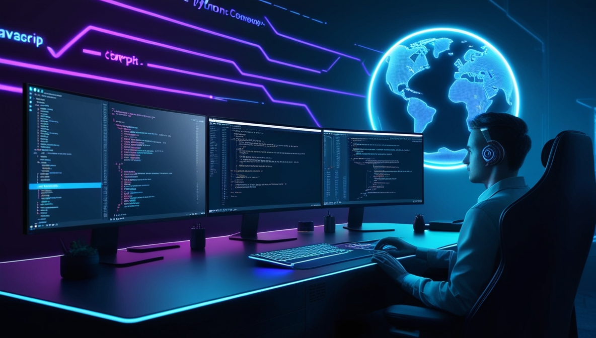

<!-- Banner Image -->

  

<!-- Introduction -->
<h1 align="center">Hi there, I'm <strong>Iresh Nimantha</strong>! 👋</h1>

  <strong>BICT Honours Undergraduate | Designer | Developer</strong> 
  Passionate about creating innovative web solutions and digital experiences. I enjoy building full-stack applications, exploring new technologies, and bringing ideas to life through code and design.

<!-- About Section -->
<h3 align="center">🎯 About Me</h3>

  🎓 Undergraduate at University of Colombo, Faculty of Technology (BICT Honours, 2022–2027) 
  💡 Driven by curiosity and a love for problem-solving in tech 
  🛠️ Skilled in full-stack development, UI/UX, and AI tools 
  🌱 Always learning and exploring new frameworks and technologies

<!-- Tech Stack Section -->
<h3 align="center">🛠 Tech & Tools I Use</h3>

<!-- Development Tools -->
<h4 align="center">💻 Development</h4>

  
  
  
  
  
  
  
  
  
  
  
  

<!-- AI Tools -->
<h4 align="center">🤖 AI Tools</h4>

  
  
  

<!-- GitHub Stats -->
<h3 align="center">📊 GitHub Stats</h3>

  <!-- Make sure this username matches your GitHub handle -->
  

<!-- Connect with Me -->
<h3 align="center">🤝 Connect with Me</h3>

  
  
  

<!-- Closing Message -->

  🔥 <em>Let's build something amazing together!</em> 🔥

